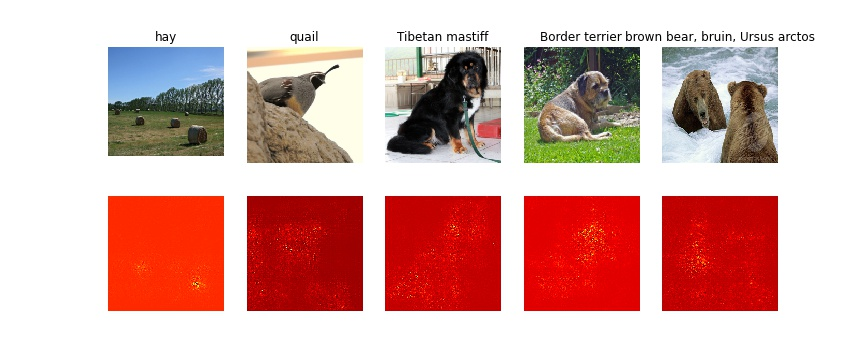
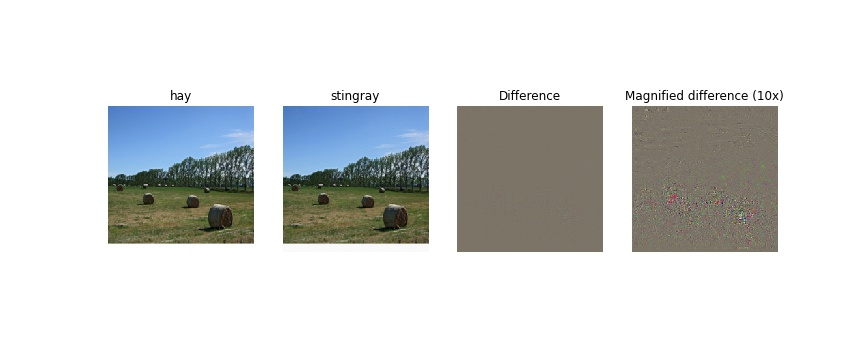
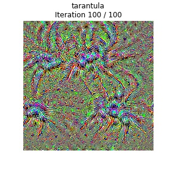
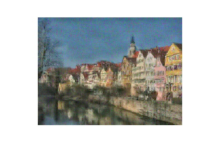
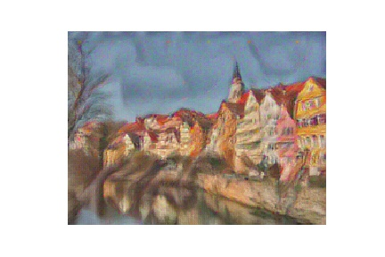

Saliency maps

Adversarial attack to an image of hays

Synthetic image of a tarantula generated using gradient ascent

Re-creating an image through feature inversion 

Style transferring Van Gogh's The Starry Night to an image

